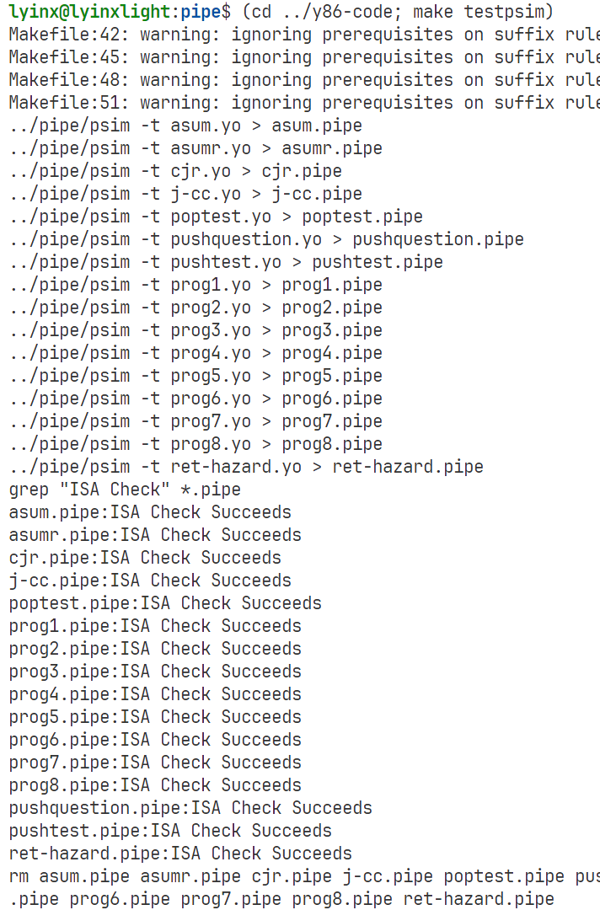
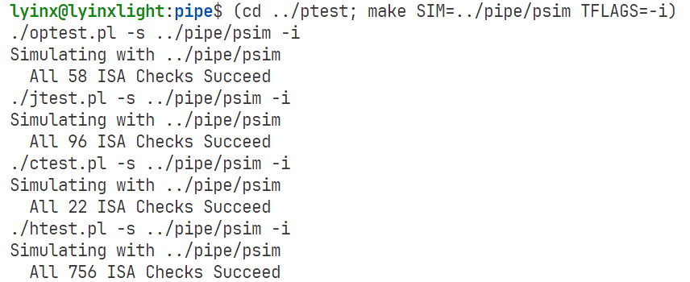
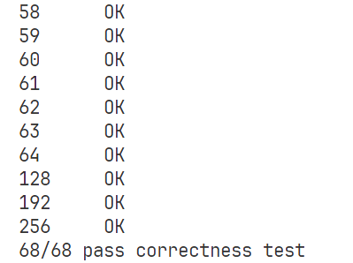
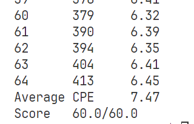

# Achitecture lab

## P0: Environment configuration

[tutorial 1: installing tools](https://zhuanlan.zhihu.com/p/480380496)

[tutorial 2: using ```-fcommon``` flags](https://stackoverflow.com/questions/63152352/fail-to-compile-the-y86-simulatur-csapp)

[tutoral 3: modify deprecated interface](https://stackoverflow.com/questions/66291922/tk-h-looks-for-tcl-h-in-usr-include-but-tcl-h-is-in-usr-include-tcl-i-dont-h)

[tutorial 4: comment ```matherr```](https://zhuanlan.zhihu.com/p/545378624) Hack for SunOS, but i used linux, it is fine to comment i think.

```shell
Linux> ./gen-driver.pl
": No such file or directory
Linux> perl gen-driver.pl
#######################################################################
# Test for copying block of size 0;
#######################################################################
        .pos 0
main:   irmovq Stack, %rsp      # Set up stack pointer

        # Set up arguments for copy function and then invoke it
        irmovq $0, %rdx         # src and dst have 0 elements
        irmovq dest, %rsi       # dst array
        irmovq src, %rdi        # src array
        call ncopy
        halt                    # should halt with num nonzeros in %rax
StartFun:
```

出现以上情况那就是GitHub上传的时候将unix风格换行自动纠正成了Windows换行再上传的，使用工具改回来就行。

```shell
Linux> sudo apt-get insatll dos2unix
....
Linux> dos2unix gen-driver.pl
```

建议多使用.gitattributes文件。

## Part A

如果你学过汇编语言，这个很简单，不磨蹭的话很快

## Part B

如果你学过计算机组成原理，写过计组实验，这个也很简单，不磨蹭的话，很快

## Part C

就算学过汇编语言和计算机组成原理，我也觉得很难。

一个星期断断续续的写，还是达不到60分的标准。

优化思路：

- iaddq 指令引入
- 循环展开:这里使用的是8路展开，余数处理参照datalab的howmanybits的思路，4，2，1展开

[代码文件](./sim/pipe/ncopy.ys)

优化结果：


后面优化不动了，以后有机会再玩。

改进思路：

- 加载转发 mrmovq 指令的优化
- 分支预测降低惩罚

需要改hcl文件，改不动了。

### 改动了

[参照思路](https://zhuanlan.zhihu.com/p/661344632?utm_id=0)

参照思路将```加载/使用冲突```改为不需要暂停，而是直接转发的方式实现，一开始发现并没有很大的提升，随后意外发现，将原来为了避免冲突而进行指令的间隔插入，改为之前产生冲突的形式（如下所示），提升巨尼玛的大。不知道为什么，个人觉得是硬件提升带来的巨大提升不然就是写错了。然后我全改成了原来会产生冲突的形式，直接过了。

```bash
@@ -20,8 +20,8 @@ ncopy:
        jl remainings
 Loop1:
        mrmovq (%rdi), %r8
-       mrmovq 8(%rdi), %r9
        rmmovq %r8, (%rsi)
+       mrmovq 8(%rdi), %r9
        rmmovq %r9, 8(%rsi)
        andq %r8, %r8
        jle test1
```

我算是知道为什么会这样了，果然是写错了，修改硬件逻辑之后ISA check没通过，但是正常执行./correctness.pl和./benchmark.pl都可以通过，离谱。

后续修改硬件逻辑，修改成了正确的，ISA CHECK通过





由于lw/use冲突的解决，在处理余数的时候，可以不用考虑插入指令，可以mrmovq和rmmovq连着用，因此将之前的4 2 1处理修改为流式逻辑，减少了rdi和rsi自增的开销。

在跳转对应的余数处理时，采用二分查找，提升较为明显，可以达到7.5~7.6的CPE，但是仍然差一点满分，通过观察，发现元素个数为1时，CPE很大，因此后续处理中，将余数为1， 2， 3的判断逻辑进行提前，同时要注意分支预测的影响。

最终结果：





循环展开和余数处理在分数提升上占比很大，但是不修改硬件逻辑很难说服我自己使用流式逻辑，修改hcl也算一种玩法吧。
