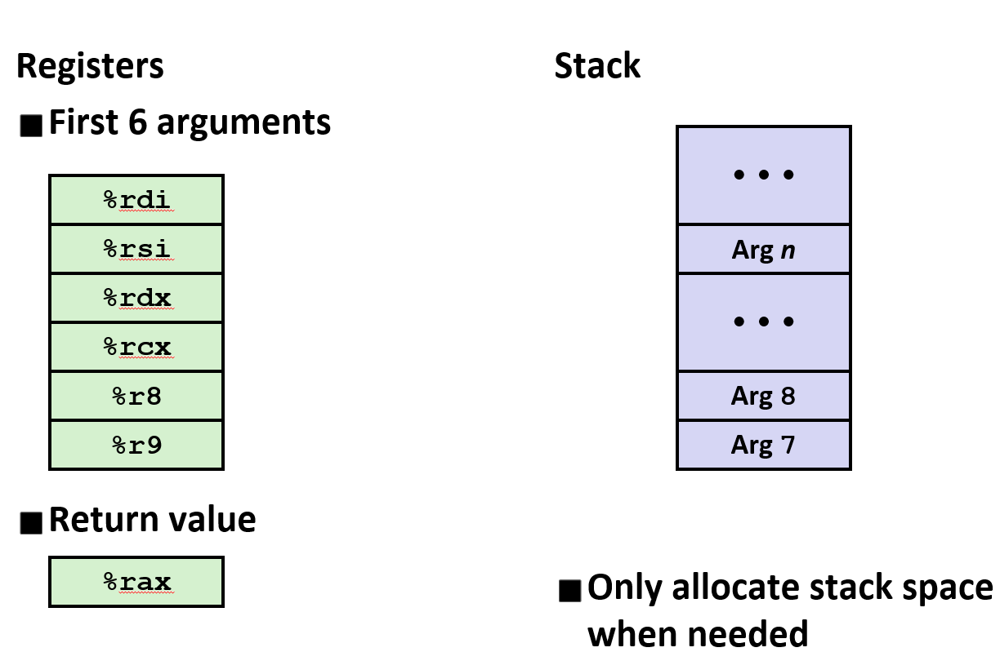

# Machine-Level Representation of Programs

C and Assembly languge

## Tools

### GCC commands

```bash
gcc -o target -c source -Og
```

Compile flags:

- -O: optimize
- -o: output filename
- -E: pre-process,generate .i file
- -S: pre-process and compile, generate .asm or .s file
- -c: pre-process, compile and assembly,generate .obj or .o file

### Disassembler

```shell
objdump -d sum
```

- -d:disassemble

### GDB

I used it when doing OS labs.It is really powerful.However, you should add debug flag when compiling.(gdb need the debug information)

commonly used flags:

- l:list code nearby
- b:set breakpoints ```b main.c:253```
- d:delete all breakpoints
- s:step, if a function step in
- n:next line(source code)
- si:step (in) assembly code
- ni:next assembly code
- p:print a variable or something else
- d:you can even disassembly in gdb
- x/24xb \<start\>: d 0010H:0018H,show data

## Assembly basic

I have learned 80x86 assembly language which,however,is 16-bit and intel syntax.

%e: extend,32-bit
%r: register:64-bit

## ABI

The first time i met this term is when i was learning systemcall interface in OS course. I didn't know it then.

**ABI** stands for "Application Binary Interface", which is the application binary interface. It defines a set of specifications for communication between applications and the operating system, or between different binary program modules. Specifically, ABI includes the following aspects:

- **Size and layout of data types**: ABI specifies the size and layout of basic data types (such as integers, floating point, etc.) in memory to ensure that the code generated by the compiler can correctly process the data.
- **Function calling convention**: This includes how functions accept parameters, how they return results, and how the call stack is managed. Function calling conventions are particularly important for implementing cross-language calling of functions.
- **Register usage**: The ABI defines which registers are used for specific tasks, and which register values ​​need to be saved and restored during function calls.(pic below)
    
- **Format of binary objects**: For example, on UNIX systems, the ELF (Executable and Linkable Format) format is usually used.
- **Name Mangling**: ABI also specifies how to represent variable and function names in the program internally in the compiler to support features such as function overloading.
